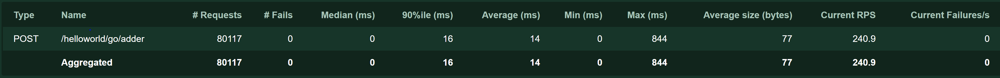
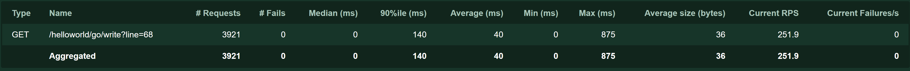
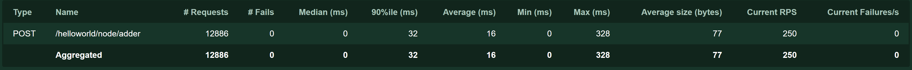
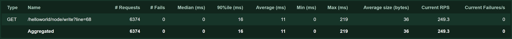

# HelloWorld

A helloworld web application written by node.js and Go.

- Assume `helloworld.html` file is being routed at `http://example.com/helloworld`
- Then, the Go application must be routed at `http://example.com/helloworld/go` and node.js application must be routed at `http://example.com/helloworld/node`


## Running the server

- Check out [`config/`](config/) files.

- Start the *nginx* service
  
  ```bash
  > sudo systemctl enable nginx
  > sudo systemctl start nginx
  ```

- Start the *golang* service
  
  ```bash
  > sudo systemctl enable helloworld-go
  > sudo systemctl start helloworld-go
  ```

- Start the *node.js* service
  
  ```bash
  > sudo systemctl enable helloworld-node
  > sudo systemctl start helloworld-node
  ```
  
## Automatic deployment

- Run *deploy/deploy-helloworld* as root like this:
  
  ```bash
  > sudo deploy-helloworld /path/to/helloworld/repository/root
  ```

## Run load test

- Install Locust:
  
  ```bash
  > pip install locust
  > locust --version
  ```

- Run the Locust for each API:
  
  - Go Adder
    
    Request:

    ```HTTP
      POST /helloworld/go/adder {
        "a": 2,
        "b": 3
      }
    ```

    Load test command:

    ```bash
    > locust -f loadtests/go_adder.py
    ```

    Result as `http://localhost:8089` with 500 users:

    
  
  - Go Write
    
    Request:

    ```HTTP
      GET /helloworld/go/write?line=68
    ```

    Load test command:

    ```bash
    > locust -f loadtests/go_write.py
    ```

    Result as `http://localhost:8089` with 500 users:

    
  
  - Node.js Adder
    
    Request:

    ```HTTP
      POST /helloworld/node/adder {
        "a": 2,
        "b": 3
      }
    ```

    Load test command:

    ```bash
    > locust -f loadtests/node_adder.py
    ```
    Result as `http://localhost:8089` with 500 users:

    
  
  - Node.js Write
    
    Request:

    ```HTTP
      GET /helloworld/node/write?line=68
    ```

    Load test command:

    ```bash
    > locust -f loadtests/node_write.py
    ```
    Result as `http://localhost:8089` with 500 users:

    